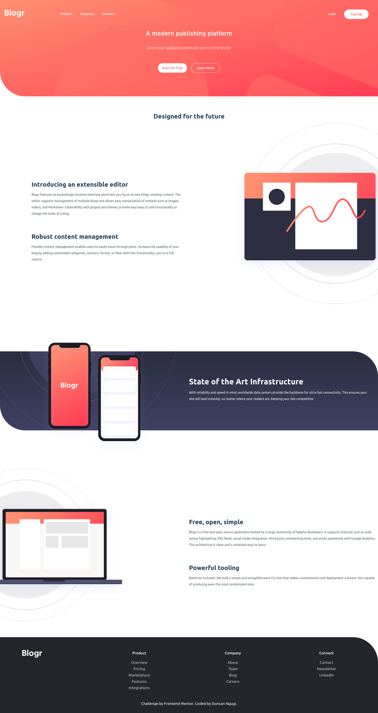
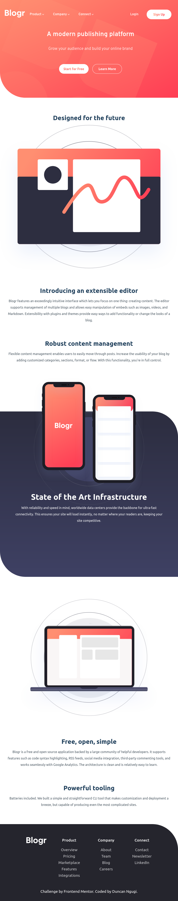
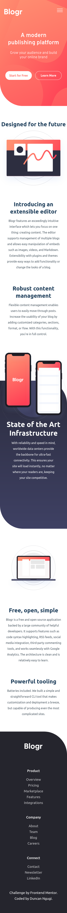
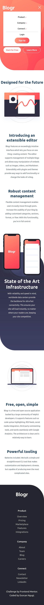

# Blogr Landing Page

This is a solution to the
[Blogr landing page challenge on Frontend Mentor](https://www.frontendmentor.io/challenges/blogr-landing-page-EX2RLAApP).
Frontend Mentor challenges help you improve your coding skills by building
realistic projects.

## Table of contents

- [Overview](#overview)
  - [The challenge](#the-challenge)
  - [Screenshot](#screenshot)
  - [Links](#links)
- [Built with](#built-with)
- [Author](#author)

## Overview

### The challenge

Users should be able to:

- View the optimal layout for the site depending on their device's screen size
- See hover states for all interactive elements on the page

### Screenshot

Large Devices

Medium Sized Devices

Small Devices
       

### Links

- [Solution URL](https://github.com/ngugimuchangi/front-end/tree/master/blogr-landing-page)
- [Demo](https://blogr-landing-page-five-teal.vercel.app/)

## Built with

- Semantic HTML5 markup
- CSS custom properties
- Flexbox
- CSS Grid
- Mobile-first workflow

## Author

- [Duncan Ngugi](https://github.com/ngugimuchangi)
