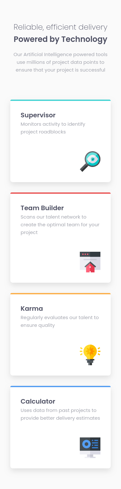
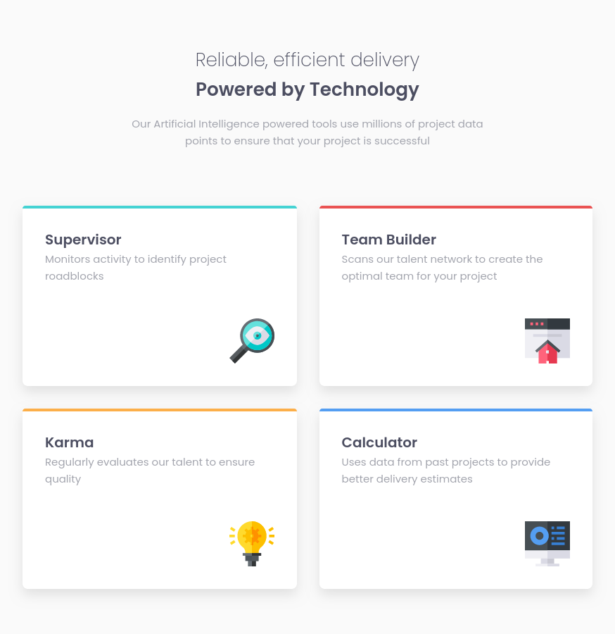
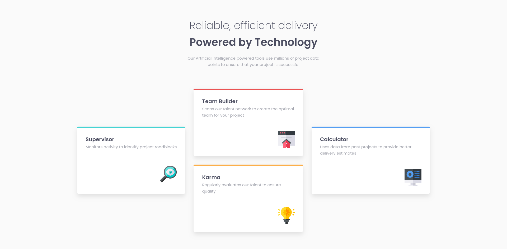

# Four card feature section

This is a solution to the
[Four card feature section challenge on Frontend Mentor](https://www.frontendmentor.io/challenges/four-card-feature-section-weK1eFYK).

## Table of contents

- [Overview](#overview)
  - [The challenge](#the-challenge)
  - [Screenshots](#screenshots)
    - [Mobile](#mobile)
    - [Tablet](#tablet)
    - [Desktop](#desktop)

## Overview

### The challenge

The challenge is to build out this feature section and get it looking as close to the
[design](design) as possible.

You can use any tools you like to help you complete the challenge. So if you've got something you'd
like to practice, feel free to give it a go.

Users should be able to:

- View the optimal layout for the site depending on their device's screen size

### Screenshots

#### Mobile

#### Tablet

#### Desktop

