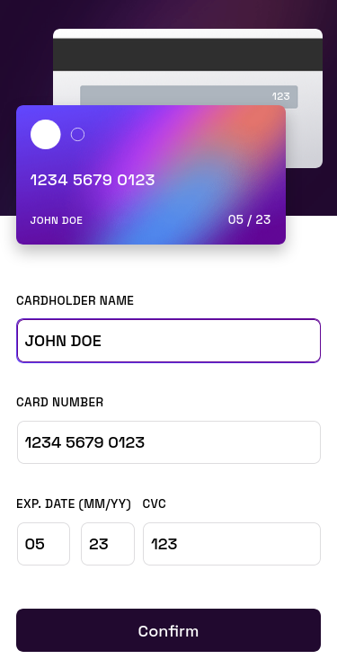
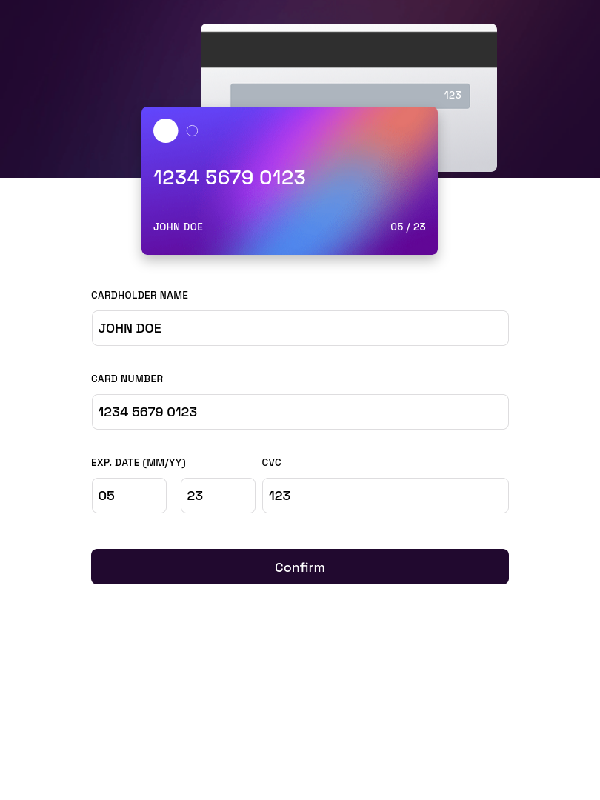

# Interactive card details form solution

This is a solution to the [Interactive card details form challenge on Frontend Mentor](https://www.frontendmentor.io/challenges/interactive-card-details-form-XpS8cKZDWw).

## Table of contents

- [Overview](#overview)
  - [The challenge](#the-challenge)
  - [Screenshots](#screenshots)
  - [Links](#links)
- [Built with](#built-with)
- [Author](#author)

## Overview

### The challenge

Users should be able to:

- Fill in the form and see the card details update in real-time
- Receive error messages when the form is submitted if:
  - Any input field is empty
  - The card number, expiry date, or CVC fields are in the wrong format
- View the optimal layout depending on their device's screen size
- See hover, active, and focus states for interactive elements on the page

### Screenshots

#### Small Devices

#### Medium Size Devices

#### Large

### Links

- [Solution URL](https://github.com/ngugimuchangi/front-end/tree/master/interactive-card-details-form)
- [Demo](hhttps://interactive-card-details-form-jet.vercel.app/)

## Built with

- Semantic HTML5 markup
- CSS custom properties
- Flexbox
- CSS Grid
- JustValidate form validation library

## Author

- [Duncan Ngugi](https://github.com/ngugimuchangi)
