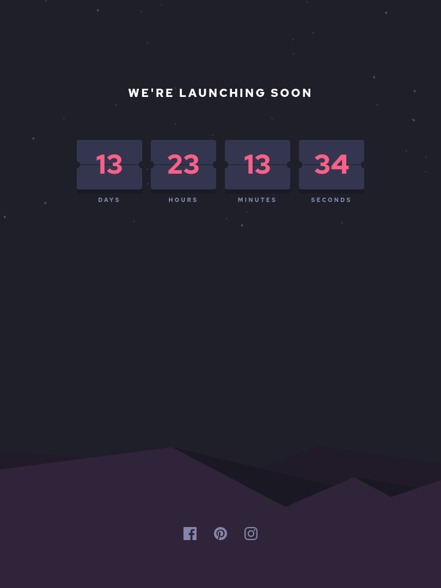
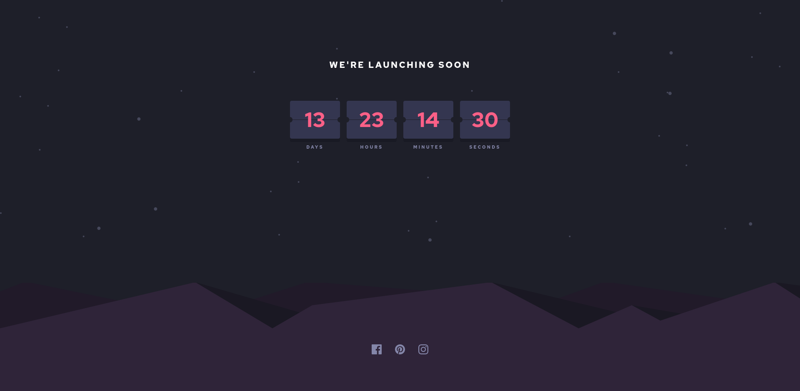

# Launch countdown timer solution

This is a solution to the [Launch countdown timer challenge on Frontend Mentor](https://www.frontendmentor.io/challenges/launch-countdown-timer-N0XkGfyz-).

## Table of contents
- [Overview](#overview)
  - [The challenge](#the-challenge)
  - [Screenshots](#screenshots)
  - [Links](#links)
- [Built with](#built-with)
- [Author](#author)

## Overview
### The challenge
Users should be able to:

- See hover states for all interactive elements on the page
- See a live countdown timer that ticks down every second (start the count at 14 days)

### Screenshots

#### Small Devices

#### Medium Size Devices

#### Large

### Links
- [Solution URL](https://github.com/ngugimuchangi/front-end/tree/master/launch-countdown-timer)
- [Demo](https://launch-countdown-timer-opal.vercel.app/)

## Built with
- Semantic HTML5 markup
- Sass
- Vanilla JS

## Author
- [Duncan Ngugi](https://github.com/ngugimuchangi)
