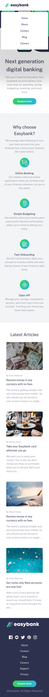
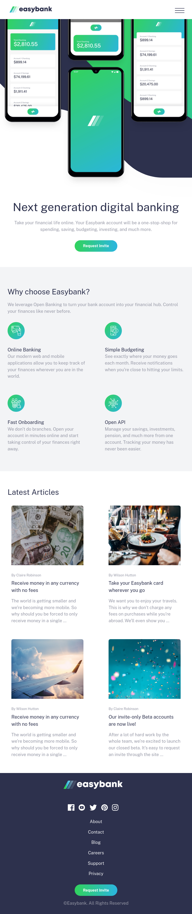
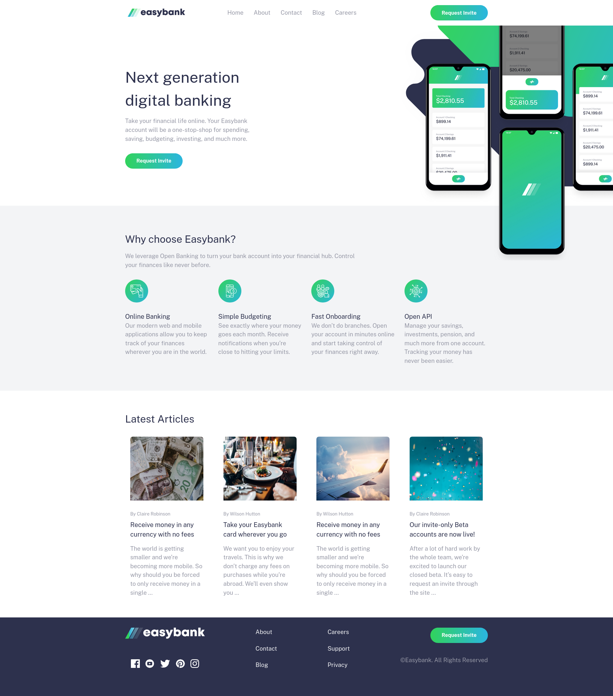

# Easybank landing page solution

This is a solution to the [Easybank landing page challenge on Frontend Mentor](https://www.frontendmentor.io/challenges/easybank-landing-page-WaUhkoDN).

## Table of contents
- [Overview](#overview)
  - [The challenge](#the-challenge)
  - [Screenshots](#screenshots)
  - [Links](#links)
- [Built with](#built-with)
- [Author](#author)

## Overview

### The challenge

Users should be able to:

- View the optimal layout for the site depending on their device's screen size
- See hover states for all interactive elements on the page

### Screenshots

#### Small Devices

#### Medium Size Devices

#### Large

### Links
- [Solution URL](https://github.com/ngugimuchangi/frontend_mentors/tree/master/easybank-landing-page)
- [Demo](https://ngugi-easybank-landing-page.netlify.app/)

## Built with

- Semantic HTML5 markup
- CSS custom properties
- Flexbox
- Sass

## Author
- [Duncan Ngugi](https://github.com/ngugimuchangi)
