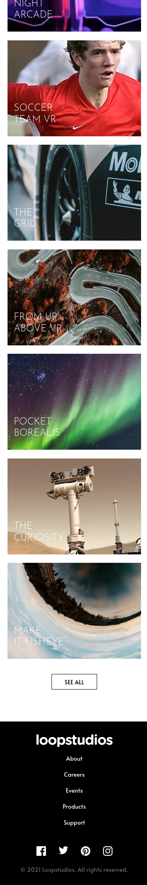
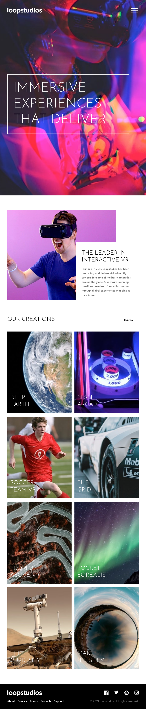

# Frontend Mentor - Loopstudios landing page

This is a solution to the
[Loopstudios landing page challenge](https://www.frontendmentor.io/challenges/loopstudios-landing-page-N88J5Onjw)
on Frontend Mentor.

## Table of contents

- [Overview](#overview)
  - [The challenge](#the-challenge)
  - [Screenshots](#screenshots)
    - [Mobile](#mobile)
    - [Tablet](#tablet)
    - [Desktop](#desktop)

## Overview

### The challenge

The challenge is to build out this landing page and get it looking as close to the [design](design)
as possible.

This challenge focuses mostly on HTML & CSS. There's a tiny bit of JS included for the mobile
navigation toggle.

Users should be able to:

- View the optimal layout for the site depending on their device's screen size
- See hover states for all interactive elements on the page

### Screenshots

#### Mobile

&emsp;

#### Tablet

#### Desktop

