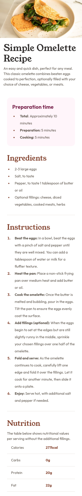
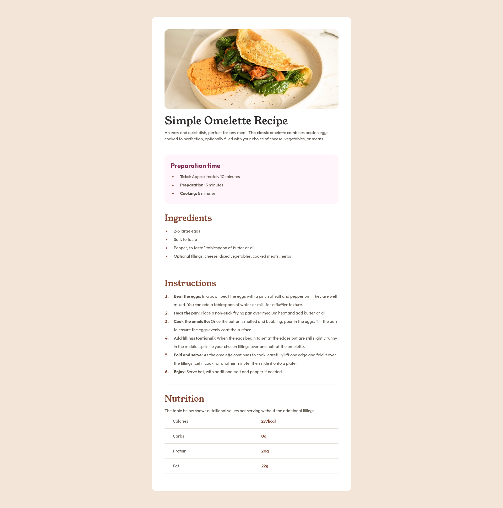

# Recipe Main Page

This is a solution to the
[Recipe page challenge on Frontend Mentor](https://www.frontendmentor.io/challenges/recipe-page-KiTsR8QQKm).

## Table of contents

- [Overview](#overview)
  - [The challenge](#the-challenge)
  - [Screenshots](#screenshots)
    - [Mobile](#mobile)
    - [Desktop](#desktop)

## Overview

### The challenge

The challenge is to build out this recipe page and get it looking as close to the [design](design)
as possible.

### Screenshots

#### Mobile

#### Desktop

