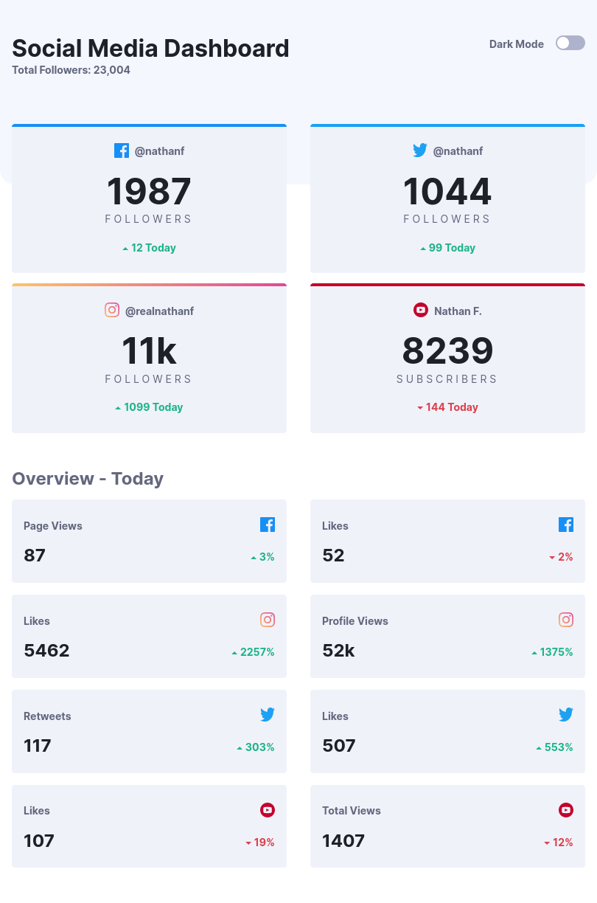

# Social media dashboard with theme switcher solution

This is a solution to the [Social media dashboard with theme switcher challenge on Frontend Mentor](https://www.frontendmentor.io/challenges/social-media-dashboard-with-theme-switcher-6oY8ozp_H).

## Table of contents
- [Overview](#overview)
  - [The challenge](#the-challenge)
  - [Screenshots](#screenshots)
  - [Links](#links)
- [Built with](#built-with)
- [Author](#author)

## Overview
### The challenge
Users should be able to:

- View the optimal layout for the site depending on their device's screen size
- See hover states for all interactive elements on the page
- Toggle color theme to their preference

### Screenshots

#### Small Devices

#### Medium Size Devices

#### Large Devices

### Links
- [Solution URL](https://github.com/ngugimuchangi/frontend_mentors/tree/master/social_media_dashboard)
- [Demo](https://ngugi-social-media-dashboard.netlify.app/)

## Built with
- ReactJs
- Semantic HTML5 markup
- Sass

## Author
- [Duncan Ngugi](https://github.com/ngugimuchangi)
